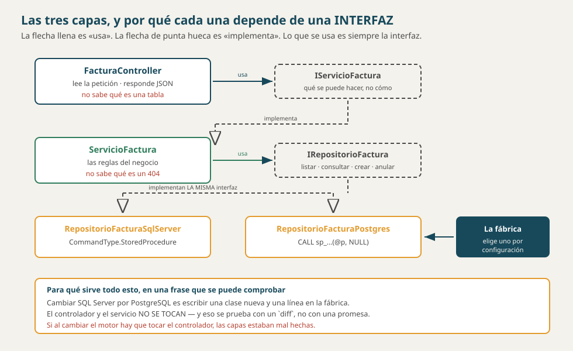

# Arquitectura — Facturación (`bdfacturas`)

> **Qué es este documento.** Cómo está partido el sistema, qué hace cada parte y
> **qué tiene prohibido hacer**. Las prohibiciones son la mitad del documento:
> una arquitectura se define tanto por lo que permite como por lo que impide.
>
> **Los conceptos detrás:**
> [`SOLID_CAPAS_PATRONES.md`](../conceptos/SOLID_CAPAS_PATRONES.md) y
> [`FLUJO_DE_UNA_PETICION.md`](../conceptos/FLUJO_DE_UNA_PETICION.md).
>
> **Material académico simulado**, pero el reparto es real y se puede comprobar
> abriendo las carpetas.
>
> Versión 1.0 · 4 de octubre de 2026.



---

## 1. Dos procesos, no uno

| Proceso | Qué es | Puerto |
|---|---|---|
| **`api-facturas`** | ASP.NET Core. La única que habla con la base | 8035 |
| **`front-blazor`** | Blazor Server. La única que le habla a la persona | 8099 |

Y un tercero que no es nuestro: **`sqlserver`**, la base. En la v5 se le suma
**`postgres`**.

> **La regla que no se negocia: en el front no puede haber un solo
> `SqlConnection`.** Si el front puede llegar a la base, la separación es un
> dibujo y no una arquitectura.
>
> **Y se comprueba, no se promete:** apague la API con la base encendida y abra
> el front. Tiene que seguir en pie, con su menú y un aviso de que el servicio
> no está disponible, **y sin una sola fila**. Si sigue mostrando datos, alguien
> abrió una conexión que no debía.

---

## 2. Las tres capas de la API

| Capa | Qué hace | Qué tiene PROHIBIDO |
|---|---|---|
| **Controlador** | Lee la petición, valida la **forma**, traduce excepciones a códigos HTTP | Escribir SQL · tomar decisiones de negocio |
| **Servicio** | Las reglas: qué se puede y qué no | Saber qué es un 404 · saber qué motor hay debajo |
| **Repositorio** | El SQL y la llamada a los procedimientos | Decidir nada |

Y entre cada par, **una interfaz**:

```
FacturaController  →  IServicioFactura   →  IRepositorioFactura
                          ↑                        ↑
                   ServicioFactura        RepositorioFacturaSqlServer
                                          RepositorioFacturaPostgres
```

> **Lo que se usa es siempre la interfaz, nunca la clase.** Por eso el servicio
> no sabe si detrás hay SQL Server, PostgreSQL o un falso en memoria — y por eso
> se puede probar sin levantar una base.

### El inventario, por recurso

Nueve recursos con sus tres capas, más los dos puentes y las vistas agregadas.
Se puede contar:

| Carpeta | Cuántos | |
|---|---|---|
| `Controllers/` | **15** | uno por recurso, más consultas, permisos y sesión |
| `Servicios/` | **14** + sus 14 interfaces | |
| `Repositorios/` | **29** implementaciones + 14 interfaces | **dos por recurso**: SqlServer y Postgres |

Esos 29 contra 14 son la arquitectura en un número: cada contrato tiene dos
implementaciones, y arriba nadie sabe cuál está puesta.

---

## 3. La fábrica, que es donde se decide el motor

```
Program.cs  →  IFabricaRepositorios  →  FabricaSqlServer
                                     →  FabricaPostgres
```

Un interruptor —la variable `MOTOR_BD`— elige cuál. **Y es el único sitio del
sistema que decide CUÁL IMPLEMENTACIÓN DE REPOSITORIO se usa.**

> **No confundirlo con «no se nombran clases concretas».** `ProductoController` y
> `ServicioProducto` lo son, y se nombran sin problema: de cada uno hay **uno
> solo**. La regla aplica donde hay **dos alternativas** — los repositorios — y
> por eso son los únicos que pasan por la fábrica.

> **Ésa es la prueba del principio abierto/cerrado, y está MEDIDA con un
> `diff`:** agregar PostgreSQL fue **18 archivos y 1 373 líneas**, de los cuales
> 12 son repositorios nuevos. Y sobre `Controllers/` y `Servicios/` el `diff`
> sale **vacío**.
>
> ```powershell
> git diff --stat v4..v5 -- api_facturas/Controllers api_facturas/Servicios
> ```
>
> **Si hubiera que tocarlos, las capas estaban mal hechas.** Nótese que el tag
> es `v4` y no `v5`: los tags son del mapa de versiones viejo, donde el motor era
> la v4. Hoy ese trabajo es la v5.

---

## 4. Dónde vive cada regla, y por qué ahí

| Regla | Dónde | Por qué no más arriba |
|---|---|---|
| El stock no queda negativo | **disparador** | Porque también vale para quien entre por SSMS |
| El total es la suma de subtotales | **disparador** | Igual, y además así no puede desactualizarse |
| Una factura tiene al menos un renglón | **procedimiento** | Va en la misma transacción que la inserta |
| Una factura no se anula dos veces | **procedimiento** | Es una condición sobre el estado, y el estado está en la base |
| El `{}` del PATCH no actualiza nada | **servicio** | Es una decisión de negocio, no de la base |
| Falta el campo `nombre` | **la petición** (anotaciones) | Es forma, y la forma se rechaza antes de entrar |
| ¿Tiene permiso? | **`[ExigePermiso]`**, antes del controlador | Para que ningún método pueda olvidarse de preguntarlo |

> **El criterio es simple:** cuanto más abajo vive una regla, a más gente
> protege. Una validación que solo está en C# protege a quien pasa por la API.

---

## 5. El front: por qué Blazor Server y qué implica

| | |
|---|---|
| **Qué es** | El componente vive **en el servidor**; el navegador recibe HTML y mantiene un **circuito** abierto |
| **Qué gana** | No hay que escribir JavaScript para la interacción, y el estado de la pantalla vive en C# |
| **Qué cuesta** | Si el circuito se corta —se recarga la página, se pierde la red— **la pantalla pierde su estado** |

> **Eso último se nota al emitir una factura:** los renglones que se van
> agregando viven en el circuito, no en la base. Oprimir F5 a mitad los pierde.
> En el front de Flask del curso de Diseño el borrador vive en la sesión y
> sobrevive al F5 — **ésa es la única diferencia real entre los dos fronts**, y
> es lo que el curso compara.

---

## 6. Lo que NO tiene esta arquitectura

Decirlo evita que alguien lo busque:

| No hay | Y en su lugar |
|---|---|
| Entity Framework ni ningún ORM | SQL escrito a mano y **Dapper** como micro-ejecutor |
| Caché | Cada petición va a la base |
| Colas, eventos, mensajería | Todo es síncrono dentro de la petición |
| Microservicios | Dos procesos, y ya |
| Repositorio genérico `Repositorio<T>` | Uno por recurso, a propósito — ver abajo |

> **Por qué no un `Repositorio<T>` genérico ni un `/api/{tabla}`.** Porque el
> contrato quedaría en blanco: Swagger no diría qué recursos hay, los permisos
> no se podrían dar por recurso, y cada cambio tocaría las doce tablas. Es el
> Artículo 10 de la constitución, y la razón está escrita ahí.

---

## 7. Comprobarlo

| Qué se afirma | Cómo se comprueba |
|---|---|
| El front no toca la base | Apague `api-facturas` y abra el front: en pie y sin filas |
| Las capas no se saltan | En `Controllers/` no hay ni un `SqlConnection` —**0 archivos**—, y en `Repositorios/` no hay ni un `StatusCode` —**0**—. La palabra `Sql` sí aparece dos veces en los controladores, pero **en comentarios**, explicando que `SqlException` se traduce a 500 |
| Cambiar de motor no toca arriba | `git diff --stat v4..v5 -- api_facturas/Controllers api_facturas/Servicios`: **vacío** |
| Las reglas están abajo | Intente dejar el stock negativo con un `INSERT` directo en SSMS |
